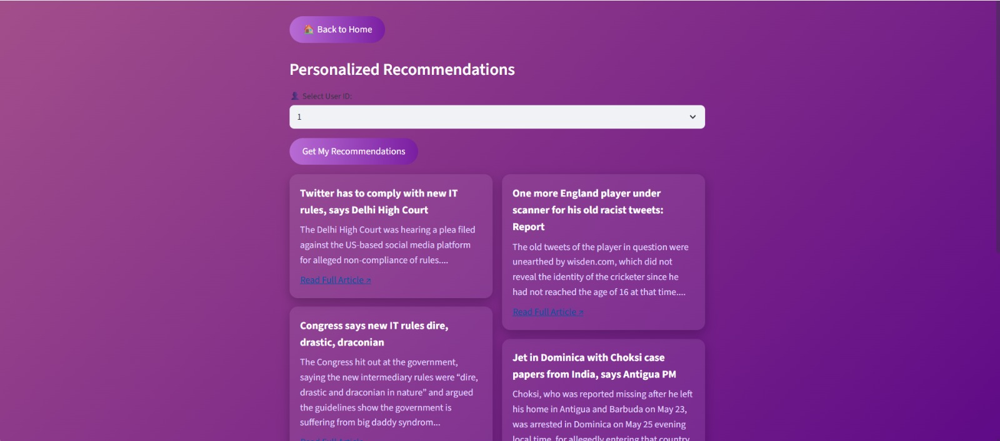
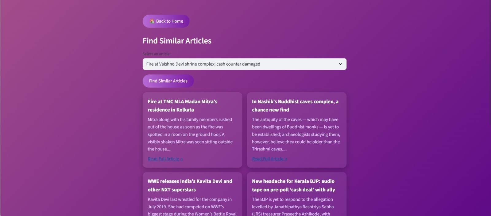

# 📰 **Personalized News Recommender System**

A **Streamlit-based news recommendation platform** that helps users discover relevant news articles using **content-based and hybrid recommendation techniques**.

🔗 **Live Demo (Deployed on Hugging Face Spaces):**  
👉 https://huggingface.co/spaces/Sirriusspec/news

---

## 📌 **Project Overview**

In today’s digital era, users are overwhelmed by the massive volume of news published every minute.  
This project addresses the challenge of **information overload** by delivering **personalized and relevant news recommendations** based on article similarity and user interaction data.

The system recommends news articles by analyzing:
- 📰 **Article content similarity**
- 👤 **User reading behavior, ratings, and engagement time**

---

## 📸 **Application Screenshots**

### 🏠 **Landing Page**
*Smart landing screen with search, hashtags, and navigation options*
<p align="center">
  
</p>

### 💜 **Personalized Recommendations**
*User-specific recommendations based on reading history*
<p align="center">
  
</p>

### 📰 **Similar Articles**
*Find news articles similar to a selected headline*
<p align="center">
  
</p>

---

## 🎯 **Key Features**

- 🔍 **News Title-Based Recommendation**  
  Finds articles similar to a selected news title using textual similarity.

- 💜 **Personalized Recommendations**  
  Generates user-specific news suggestions based on past interactions.

- 🧠 **Hybrid Recommendation Approach**  
  Combines:
  - Content-Based Filtering (**TF-IDF + Cosine Similarity**)
  - Collaborative signals (**user ratings and engagement time**)

- 🎨 **Interactive Streamlit UI**  
  Clean and modern interface with hashtag-based search and card-style article display.

---

## 🛠️ **Technologies Used**

- **Programming Language:** Python  
- **Frontend Framework:** Streamlit  
- **Machine Learning:** Scikit-learn  
- **Natural Language Processing:**
  - TF-IDF Vectorization
  - Cosine Similarity  
- **Data Handling:** Pandas, NumPy  
- **Deployment Platform:** Hugging Face Spaces  

---

## 🧩 **Recommendation Methodology**

### 1️⃣ **Content-Based Filtering**
- Converts news titles into TF-IDF feature vectors
- Computes similarity using cosine similarity
- Recommends articles with the highest semantic relevance

### 2️⃣ **Personalized Hybrid Recommendation**
- Incorporates:
  - User ratings
  - Time spent reading articles
- Calculates weighted similarity scores
- Filters out already-read articles to improve recommendation diversity

---

## 📂 **Project Structure**

```text
├── app.py                     # Streamlit application
├── news_articles.pkl          # News dataset
├── similarity.pkl             # Precomputed similarity matrix
├── user_rated_articles.pkl    # User interaction data
├── News.pkl                   # Supporting data file
├── .gitignore
└── README.md
```
## ▶️ **How to Run Locally**
```
# Activate virtual environment
.\.venv\Scripts\Activate.ps1

# Install required dependencies
pip install -r requirements.txt

# Run the Streamlit application
streamlit run app.py
```

---

## 🚀 **Future Enhancements**

* Integration of deep learning embeddings (**Word2Vec, Doc2Vec, BERT**)
* Feedback-based model refinement
* Multilingual news recommendation support
* Advanced evaluation metrics (**Precision, Recall, F1-score, MAP**)

---


